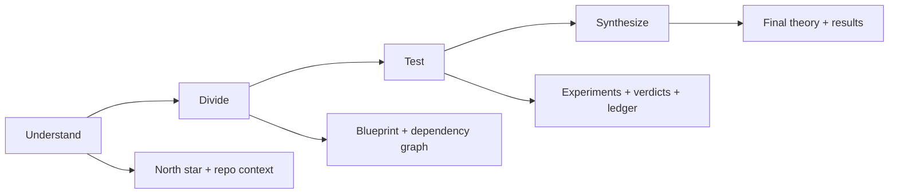
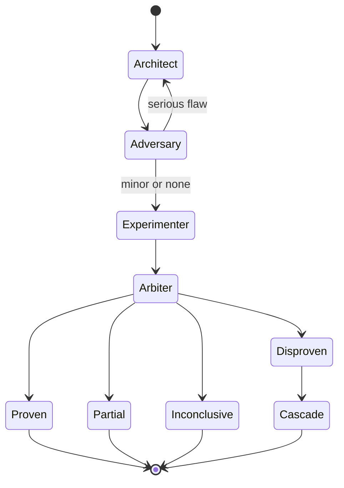

# Principia


> Turn a philosophical principle into a working algorithm through rigorous adversarial testing.

Principia is a claim-driven design system for taking a vague idea and forcing it into something falsifiable, inspectable, and buildable. It decomposes a principle into testable claims, pressure-tests those claims through structured debate and empirical experiments, and then composes the survivors into a design record you can actually ship against.

| Claude | Codex |
| --- | --- |
| [plugins/claude/README.md](plugins/claude/README.md) | [plugins/codex/README.md](plugins/codex/README.md) |

Both bundles run against the same packaged Principia runtime under `principia/`. A full Principia checkout remains the install surface for both because the bundles depend on `principia/`, `agents/`, and `config/`.

Terminology: `principia` is the Python package and plugin identity, `plugins/claude` and `plugins/codex` are installable bundle paths, and `principia/` inside a project is the generated workflow workspace.

[Installation](#installation) | [Why Principia](#why-principia) | [Quick Start](#quick-start) | [Outputs](#outputs) | [How It Works](#how-it-works) | [Architecture](#architecture) | [Development](#development) | [Changelog](CHANGELOG.md)

## Why Principia

- Claim-first: every large idea gets decomposed into explicit, testable units with tracked dependencies.
- Adversarial by design: architect and adversary roles are separated so early consensus does not get mistaken for rigor.
- Evidence-backed: experiments, verdicts, and state changes are recorded into an auditable workspace and SQLite ledger.
- Operator-friendly: status reports, result summaries, and a generated explorer make the workflow inspectable without digging through raw files.

## Installation

Principia ships as a full repository checkout with one shared packaged runtime under `principia/`. Pick the canonical plugin bundle that matches your agent surface:

| Surface | Best for | Canonical install surface | First entry point |
| --- | --- | --- | --- |
| Claude Code | slash-command workflow inside Claude Code | `plugins/claude` | `/principia:init` |
| Codex | skill-driven workflow inside Codex | `./plugins/codex` | `principia:init` |

Requires **Python 3.12+**. Runtime execution is stdlib-only; development and verification use `uv`.

### Claude Code

Use the canonical Claude bundle directly from the checkout:

```bash
claude --plugin-dir ./plugins/claude
```

After Claude starts, run `/help` to confirm the namespaced Principia skills are loaded from `plugins/claude`.

### Codex

Codex CLI `0.121.0` and newer can add the published Principia marketplace directly from GitHub:

```bash
codex marketplace add Gavin-Qiao/principia
```

The remote install surface is the repository root `marketplace.json`, which exposes `./plugins/codex` from the cloned marketplace root.

For local development and repo-scoped discovery, the checkout also publishes `.agents/plugins/marketplace.json`, which points to the same `./plugins/codex` bundle.

Open the Principia checkout in Codex, then install the `principia` plugin from either marketplace surface. The installed bundle uses the packaged runtime entrypoint under `principia/cli/codex_runner.py`.

Codex plugins expose Principia through skills rather than slash commands. The normal Codex-first path is `principia:init`, then `principia:status`, `principia:next-step`, `principia:results`, and `principia:validate` when you need an integrity check.

### Packaged Runtime Verification

Release verification should prove that the built package, not just the editable checkout, can load the bundled agent and config assets.

Unix-like shells:

```bash
uv build --wheel --out-dir dist
uv venv .tmp/principia-wheel
uv pip install --python .tmp/principia-wheel/bin/python dist/principia-*.whl
.tmp/principia-wheel/bin/python -m principia.cli.codex_runner --root principia build
```

Windows PowerShell:

```powershell
uv build --wheel --out-dir dist
uv venv .tmp/principia-wheel
uv pip install --python .tmp\principia-wheel\Scripts\python.exe dist\principia-*.whl
.tmp\principia-wheel\Scripts\python.exe -m principia.cli.codex_runner --root principia build
```

## Quick Start

### Codex

1. Install the `principia` plugin from `./plugins/codex`.
2. Reload Codex so the Principia skills are available.
3. Run `principia:init` to create or lock the workflow workspace at `principia/`.
4. Run `principia:status` for live state, `principia:next-step` for the next action, and `principia:results` for synthesis.

### First 10 Minutes in Codex

1. `principia:init` creates `principia/`, inspects the repo, and locks the north star.
2. `principia:status` tells you what phase the workflow is in, which warnings matter, and whether a human decision, drift check, or handoff is blocking progress.
3. `principia:next-step` answers "what do I do next?" with the preferred command or human review action.
4. `principia:results` summarizes what the current report says before pointing you to `principia/RESULTS.md`.

### Claude

| Goal | Command |
| --- | --- |
| Initialize a workspace | `/principia:init` |
| Inspect live status | `/principia:status` |
| Advance the next action | `/principia:step` |
| Refresh final synthesis | `/principia:results` |

The init flow inspects the repository, scaffolds the workspace, gathers autonomy and delegation preferences, and keeps the conversation open until the north star is explicitly locked.

If you want the visual overview immediately, generate the explorer after init:

```bash
uv run python -m principia.cli.codex_runner --root principia visualize
```

## Outputs

Principia leaves behind artifacts that are useful both for the operator and for later review:

| Artifact | Purpose |
| --- | --- |
| `PROGRESS.md` | current state, blockers, and next-work summary |
| `FOUNDATIONS.md` | load-bearing assumptions and fragility map |
| `RESULTS.md` | final synthesis for the investigated principle |
| `WORKSPACE_EXPLORER.html` | interactive visual map of the workspace |
| `principia/.db/research.db` | append-only audit trail of nodes, edges, dispatches, and verdicts |

### Visual Workspace Explorer

The generated explorer is designed for inspection rather than hand-editing. It renders claim hierarchy, dependency links, transition history, timeline events, and the full prompt/response artifacts for each agent handoff. Open `WORKSPACE_EXPLORER.html` directly or serve the workspace directory over HTTP if you want browser navigation and local asset loading to behave consistently.

## How It Works

Principia runs as a four-phase pipeline:

| Phase | What happens | Primary output |
| --- | --- | --- |
| Understand | refine the principle, inspect the repo, collect prior art | north star and context |
| Divide | break the principle into testable claims and dependencies | blueprint and claim tree |
| Test | run debate, experiments, and verdicts per claim | evidence, verdicts, cascades |
| Synthesize | compose surviving claims into a coherent design | `composition.md`, `synthesis.md`, `RESULTS.md` |



### Per-Claim Loop

Each claim is tested through a deliberately adversarial loop. If the adversary still finds serious flaws, the conductor can keep the debate alive; if the claim stabilizes, it moves to experiment and verdict.



### Verdicts

| Verdict | Meaning | Operational effect |
| --- | --- | --- |
| `PROVEN` | claim holds under current evidence | dependents can continue |
| `DISPROVEN` | claim fails | downstream dependents are weakened |
| `PARTIAL` | claim holds conditionally | narrow scope or gather more evidence |
| `INCONCLUSIVE` | evidence is insufficient | retry later or defer |

## Agent System

Principia uses eight specialized agents with intentionally different responsibilities and access levels:

| Agent | Responsibility | Access model |
| --- | --- | --- |
| `@architect` | proposes designs from first principles | isolated from codebase |
| `@adversary` | finds flaws, counterexamples, and edge cases | isolated from codebase |
| `@experimenter` | writes and runs tests | full codebase access |
| `@arbiter` | evaluates evidence and renders verdicts | read-only codebase |
| `@conductor` | orchestrates the claim lifecycle | full access plus agent control |
| `@synthesizer` | decomposes principles and recomposes results | isolated from codebase |
| `@scout` | surveys prior art and failure cases | web plus read access |
| `@deep-thinker` | handles hard mathematical or theoretical reasoning | web research only |

This split is deliberate. The architect and adversary do not see the live codebase so they reason from the packet, not from local implementation bias. The experimenter gets the opposite constraint because empirical testing is the point.

## Architecture

The repository is organized around one shared Python engine with separate agent-facing bundles:

| Path | Purpose |
| --- | --- |
| `principia/` | shared runtime package: API, CLI, orchestration, reporting, validation |
| `plugins/claude/` | canonical Claude Code bundle |
| `plugins/codex/` | canonical Codex bundle |
| `agents/` | bundled agent role prompts |
| `config/` | orchestration defaults and reference docs |
| `scripts/` | compatibility shim layer for legacy entrypoints |

### Generated Workspace Layout

Inside a user repository, Principia builds a research workspace that looks like this:

```text
principia/
|-- .north-star.md
|-- .context.md
|-- blueprint.md
|-- composition.md
|-- synthesis.md
|-- RESULTS.md
|-- PROGRESS.md
|-- FOUNDATIONS.md
|-- .db/
|   `-- research.db
|-- context/
`-- claims/
    `-- claim-N-name/
        |-- claim.md
        |-- architect/round-K/
        |-- adversary/round-K/
        |-- experimenter/results/
        `-- arbiter/results/
```

## Configuration

Workflow behavior is controlled from repo-local configuration files created during init.

Autonomy example:

```yaml
autonomy:
  mode: checkpoints
  checkpoint_at: [understand, divide, test, synthesize]
```

Debate tuning example:

```yaml
debate_loop:
  max_rounds: 3
  final_say: adversary
```

`checkpoints` is the default operator-friendly mode. `yolo` is intended for unattended runs once you trust the workflow for that repository.

## Development

```bash
uv sync --dev
uv run python -m pytest tests/ -q
uv run ruff check scripts/ tests/
uv run ruff format --check scripts/ tests/
uv run --python 3.12 python -m mypy scripts/ principia/
```

## License

MIT
