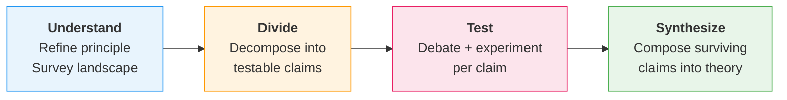
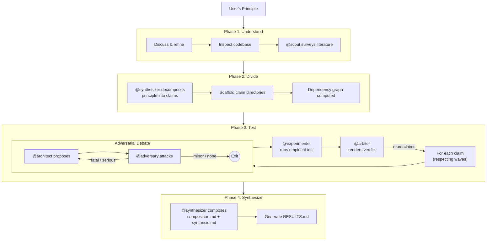
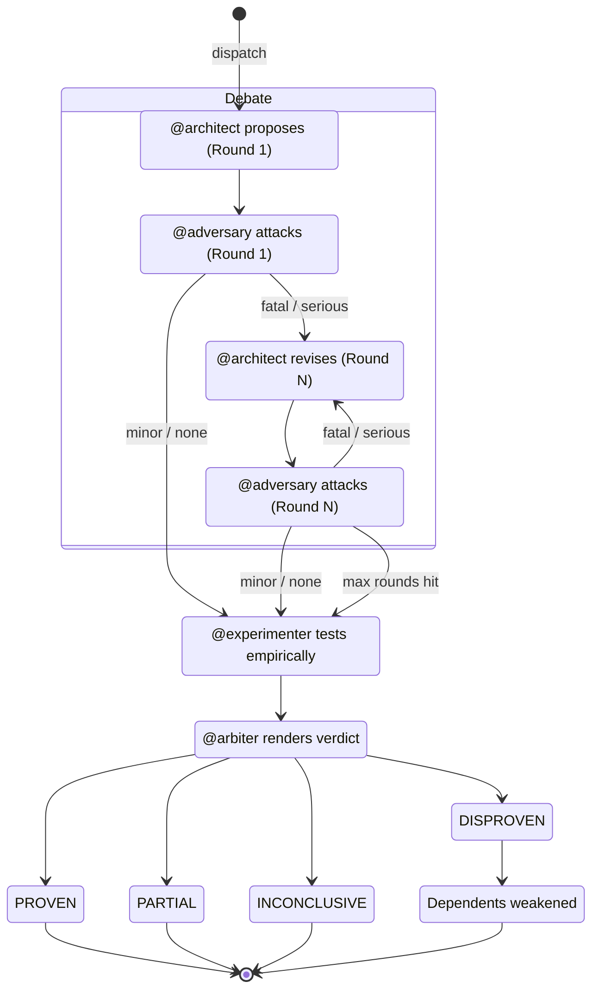
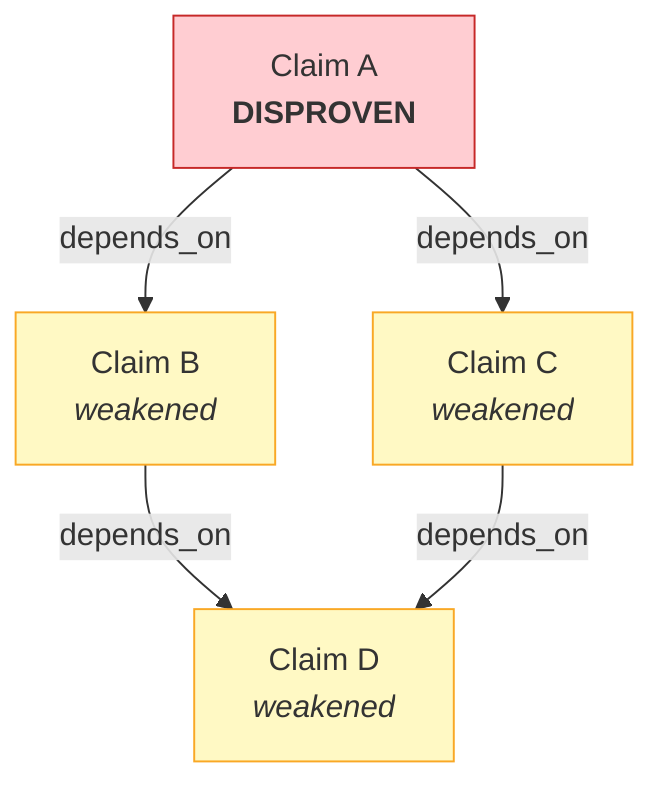
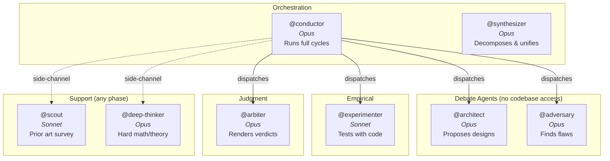

<div align="center">

# principia

**Turn a philosophical principle into a working algorithm through rigorous adversarial testing.**

[](https://github.com/Gavin-Qiao/principia/releases)
[](LICENSE)
[](https://www.python.org/downloads/)
[]()
[](https://docs.anthropic.com/en/docs/claude-code)

You start with an insight. Principia decomposes it into testable claims, stress-tests each through structured debate and empirical experiments, and composes the surviving pieces into a theory you can build on.

[Installation](#installation) | [Quick Start](#quick-start) | [How It Works](#how-it-works) | [Commands](#commands) | [Configuration](#configuration)

</div>

---

## Installation

```bash
claude plugin install principia
# or
claude --plugin-dir /path/to/principia
```

Requires **Python 3.10+** (stdlib only -- no pip packages at runtime) and **Claude Code 2.0+**.

## Quick Start

```
/principia:init "Topological Enrichment"
/principia:design "Persistent homology captures information that clustering
algorithms discard. An algorithm that preserves topological features during
hierarchical merging should produce more faithful cluster boundaries."
```

That's it. Principia runs four phases automatically:



Add `--quick` to skip research, limit debate to 1 round, and get results fast.

## How It Works

### The Investigation Pipeline



### Per-Claim Debate Loop

Each claim goes through an adversarial cycle. The conductor can extend debate rounds if the adversary is still finding serious flaws and the architect is making real progress.



### Verdict Cascade

When a claim is disproven, all claims that depend on it are automatically weakened:



| Verdict | Effect |
|---------|--------|
| **PROVEN** | Claim confirmed. Dependents can proceed. |
| **DISPROVEN** | Hypothesis fails. Dependents **weakened** via cascade. |
| **PARTIAL** | Holds under conditions. Narrow or gather more evidence. |
| **INCONCLUSIVE** | Insufficient evidence. Try a different approach or defer. |

## Agents



The architect and adversary have **no codebase access** -- isolated to prevent anchoring bias. The conductor monitors for **sycophancy** (premature agreement) and can extend debate or inject counter-evidence via scout.

## Commands

| Command | What it does |
|---------|-------------|
| `/principia:init [title]` | Bootstrap a new project |
| `/principia:design "<principle>" [--quick]` | Full pipeline: principle to algorithm |
| `/principia:step [path]` | Advance one step manually |
| `/principia:status` | Regenerate PROGRESS.md |
| `/principia:impact <id>` | Preview cascade: what breaks if this claim is disproven? |
| `/principia:query "<sql>"` | Query the evidence database directly |

<details>
<summary><b>Internal commands</b> (used by agents and skills)</summary>

| Command | What it does |
|---------|-------------|
| `/principia:scaffold <level> <name>` | Create directory structure for a claim |
| `/principia:new <path>` | Create a design file with auto-generated frontmatter |
| `/principia:falsify <id> [--by <id>]` | Mark a claim as disproven and cascade |
| `/principia:settle <id>` | Mark a claim as proven |
| `/principia:validate` | Check design log integrity |
| `/principia:methodology` | Reference: the principia design methodology |

</details>

## Configuration

### Autonomy

By default, Principia pauses at each phase transition for confirmation. Set **yolo mode** to run fully automated (e.g., overnight):

```yaml
# config/orchestration.yaml
autonomy:
  mode: yolo               # checkpoints (default) | yolo
  checkpoint_at: [understand, divide, test, synthesize]
```

| Mode | Behavior |
|------|----------|
| **checkpoints** (default) | Pauses between phases, asks about claim complexity, prompts on non-terminal verdicts |
| **yolo** | Reports progress and continues automatically -- designed for unattended overnight runs |

### Workflow tuning

```yaml
# config/orchestration.yaml
debate_loop:
  max_rounds: 3          # cap on debate rounds (conductor can extend per-claim)
  final_say: adversary   # who gets last word

severity_keywords:
  fatal: ["fatal", "blocks the approach"]
  minor: ["minor", "worth noting"]
```

The conductor can override `max_rounds` for a specific claim via `extend-debate` when the debate is making real progress but hasn't resolved.

### Dispatch mode

Created by `/principia:init` in `design/.config.md`:

- **internal** (default): agents run as Claude Code subagents
- **external**: generates a self-contained prompt you can paste into any LLM

## Research Tracking

Principia maintains a SQLite database (`design/.db/research.db`) with an append-only audit trail:

| Table | What it tracks |
|-------|---------------|
| **ledger** | Every state change (proven, disproven, weakened) with timestamp and agent |
| **dispatches** | Every agent invocation: who, when, which claim, which round |
| **nodes** | All claims, assumptions, evidence with status and metadata |
| **edges** | Dependency graph (depends_on, assumes, falsified_by) |

Generated reports: `PROGRESS.md` (current blockers and status), `FOUNDATIONS.md` (load-bearing assumptions), `RESULTS.md` (final investigation summary).

The ledger and dispatches survive database rebuilds -- your research history is never lost.

## Directory Structure

```
design/
├── .north-star.md                  # Refined principle
├── .context.md                     # Codebase inspection findings
├── claims/                         # One directory per testable claim
│   └── claim-N-name/
│       ├── architect/round-K/      # Hypothesis proposals
│       ├── adversary/round-K/      # Stress-test attacks
│       ├── experimenter/results/   # Empirical tests
│       ├── arbiter/results/        # Verdicts
│       └── claim.md                # Claim frontmatter + statement
├── context/                        # Scout research outputs
├── blueprint.md                    # Claim registry from synthesizer
├── composition.md                  # Unified algorithm design
├── synthesis.md                    # Cross-claim analysis
├── RESULTS.md                      # Final investigation summary
├── PROGRESS.md                     # Auto-generated status
└── FOUNDATIONS.md                   # Tracked assumptions
```

<details>
<summary><b>Frontmatter schema</b></summary>

```yaml
---
id: <auto-derived from path>
type: claim | assumption | evidence | reference | verdict | question
status: pending | active | proven | disproven | partial | weakened | inconclusive
date: YYYY-MM-DD
depends_on: [claim-id, ...]
assumes: [assumption-id, ...]
maturity: theorem-backed | supported | conjecture | experiment
confidence: high | moderate | low
---
```

</details>

## Glossary

| Term | Definition |
|------|-----------|
| **Claim** | A testable assertion decomposed from the user's principle |
| **Blueprint** | Synthesizer's decomposition of a principle into claims with dependency ordering |
| **Verdict** | Outcome of an adversarial cycle: PROVEN, DISPROVEN, PARTIAL, or INCONCLUSIVE |
| **Cascade** | When a claim is disproven, dependents are automatically weakened |
| **Wave** | Claims with no mutual dependencies that can be tested in parallel |
| **Severity** | Adversary's rating (Fatal/Serious/Minor/None) -- determines debate continuation |
| **Falsification** | Pre-registered criterion that would disprove a claim |
| **Anti-convergence** | Protocol that detects premature agent agreement and injects counter-evidence |

## Development

```bash
uv sync --dev                          # install dev dependencies
uv run python -m pytest tests/ -q      # 373 tests
uv run ruff check scripts/ tests/      # lint
uv run ruff format --check scripts/    # format
uv run python -m mypy scripts/         # type check
```

## License

MIT
