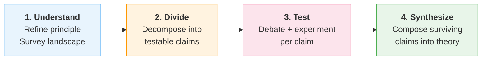
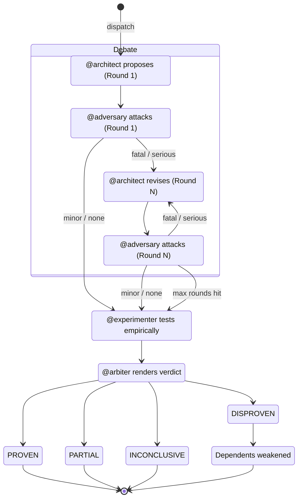
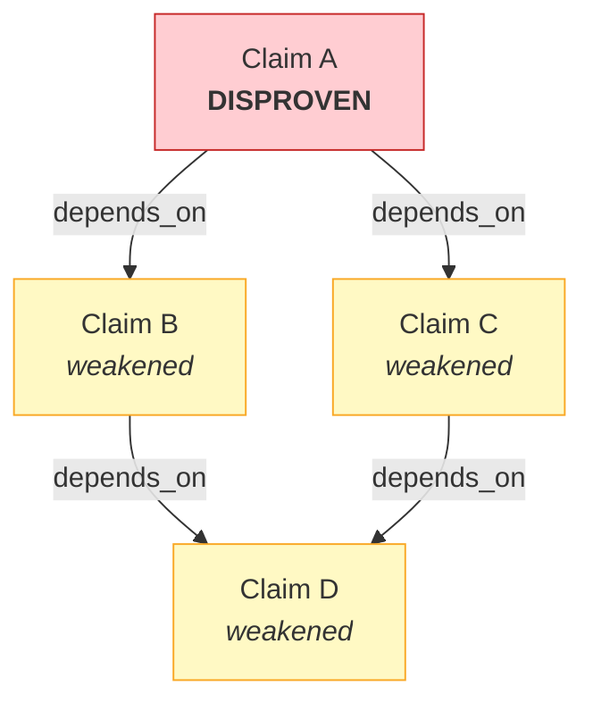

# Principia

Principia turns a philosophical principle into a working algorithm through rigorous adversarial testing. You start with an insight, Principia decomposes it into testable claims, stress-tests each through structured debate and empirical experiments, and composes the surviving pieces into a theory you can build on.

| Claude | Codex |
| --- | --- |
| [plugins/claude/README.md](plugins/claude/README.md) | [plugins/codex/README.md](plugins/codex/README.md) |

Use the chooser above to pick the canonical plugin bundle for your agent surface. Both bundles run against the same packaged Principia runtime under `principia/`. A full Principia checkout remains the install surface for both because the bundles depend on `principia/`, `agents/`, and `config/`.

[Installation](#installation) | [Quick Start](#quick-start) | [How It Works](#how-it-works) | [Agents](#agents) | [Commands](#commands) | [Configuration](#configuration) | [Changelog](CHANGELOG.md)

## Installation

Principia ships as a full repository checkout with one shared packaged runtime under `principia/`. Pick the canonical plugin bundle that matches your agent surface:

| Claude | Codex |
| --- | --- |
| [plugins/claude/README.md](plugins/claude/README.md) | [plugins/codex/README.md](plugins/codex/README.md) |

Both bundles run against the same Principia runtime and shared repo content. The Claude bundle is the Claude Code surface. The Codex bundle is the repo-local plugin surface. A full Principia checkout remains the install surface for both because the bundles depend on `principia/`, `agents/`, and `config/`.

Requires **Python 3.12+** (stdlib only -- no pip packages at runtime).

### Claude Code

Use the canonical Claude bundle directly from the checkout:

```bash
claude --plugin-dir ./plugins/claude
```

After Claude starts, run `/help` to confirm the namespaced Principia skills are loaded from `plugins/claude`.

### Codex

Codex CLI `0.121.0` and newer can add the published Principia marketplace directly from GitHub:

```bash
codex marketplace add Gavin-Qiao/principia
```

The remote install surface is the repository root `marketplace.json`, which exposes `./plugins/codex` from the cloned marketplace root.

For local development and repo-scoped discovery, the checkout also publishes `.agents/plugins/marketplace.json`, which points to the same `./plugins/codex` bundle.

Open the Principia checkout in Codex, then install the `principia` plugin from either marketplace surface. The installed bundle uses the packaged runtime entrypoint under `principia/cli/codex_runner.py`.

Codex plugins expose Principia through skills rather than slash commands. In Codex, start with the `principia:init` skill, then continue with `principia:status` and `principia:next-step`, or simply ask Codex in natural language to initialize or advance the Principia workflow.

### Packaged Runtime Verification

Release verification should prove that the built package, not just the editable checkout, can load the bundled agent and config assets:

```bash
uv build --wheel --out-dir dist
uv venv .tmp/principia-wheel
uv pip install --python .tmp/principia-wheel/bin/python dist/principia-*.whl
```

From that clean environment, verify the packaged CLI still works:

```bash
.tmp/principia-wheel/bin/python -m principia.cli.codex_runner --root principia build
```

## Quick Start

Claude:

```
/principia:init
/principia:status
/principia:step
```

Codex:

```
principia:init
principia:status
principia:next-step
```

In Claude, `/principia:init` is the front door. In Codex, the equivalent entry point is the `principia:init` skill. Both surfaces inspect the repo, scaffold `principia/`, ask about autonomy and sidecar preferences, and conduct the discussion that locks the north star before the deeper workflow begins.

After init, Principia runs four phases:



Add `--quick` to skip research, limit debate to 1 round, and get results fast.

## How It Works

### The Investigation Pipeline

```mermaid
flowchart TD
    P["User's Principle"] --> U

    subgraph U ["Phase 1: Understand"]
        U1["Discuss & refine<br/><i>with user</i>"] --> U2["Inspect codebase"]
        U2 --> U3["<b>@scout</b> surveys literature"]
        U3 -.-> DT1["<b>@deep-thinker</b><br/><i>if hard math questions arise</i>"]
    end

    U --> D

    subgraph D ["Phase 2: Divide"]
        D1["<b>@synthesizer</b> decomposes<br/>principle into claims"] --> D2["Scaffold claim directories"]
        D2 --> D3["Dependency graph computed"]
        D1 -.-> DT2["<b>@deep-thinker</b><br/><i>if decomposition needs<br/>theoretical grounding</i>"]
    end

    D --> T

    subgraph T ["Phase 3: Test"]
        T1["For each claim<br/><i>(respecting dependency waves)</i>"]
        T1 --> DEBATE
        DEBATE --> EXP["<b>@experimenter</b><br/>runs empirical test"]
        EXP --> VERDICT["<b>@arbiter</b><br/>renders verdict"]
        VERDICT -->|"more claims"| T1
    end

    T --> S

    subgraph S ["Phase 4: Synthesize"]
        S1["<b>@synthesizer</b> composes<br/>composition.md + synthesis.md"]
        S1 --> S2["Generate RESULTS.md"]
        S1 -.-> DT3["<b>@deep-thinker</b><br/><i>if conflicting verdicts need<br/>mathematical reconciliation</i>"]
    end

    subgraph DEBATE ["Adversarial Debate (1-3+ rounds)"]
        A1["<b>@architect</b> proposes"] --> A2["<b>@adversary</b> attacks"]
        A2 -->|"fatal / serious"| A1
        A2 -->|"minor / none"| EXIT(("Exit"))
    end

    T -.-> SCO["<b>@scout</b><br/><i>mid-debate prior art<br/>if debate stalls</i>"]
```



### Per-Claim Debate Loop

Each claim goes through an adversarial cycle. The `@conductor` orchestrates the full loop and can extend debate rounds if the adversary is still finding serious flaws.



### Verdict Cascade

When a claim is disproven, all claims that depend on it are automatically weakened:



| Verdict | Effect |
|---------|--------|
| **PROVEN** | Claim confirmed. Dependents can proceed. |
| **DISPROVEN** | Hypothesis fails. Dependents **weakened** via cascade. |
| **PARTIAL** | Holds under conditions. Narrow or gather more evidence. |
| **INCONCLUSIVE** | Insufficient evidence. Try a different approach or defer. |

## Agents

Principia uses 8 specialized agents. Each has a specific role and constrained access to prevent bias.

### Agent-Phase Map

| Agent | Role | Understand | Divide | Test | Synthesize |
|-------|------|:----------:|:------:|:----:|:----------:|
| **@architect** | Proposes designs from first principles | | | proposes | |
| **@adversary** | Finds flaws, counterexamples, edge cases | | | attacks | |
| **@experimenter** | Tests claims with code and synthetic data | | | experiments | |
| **@arbiter** | Evaluates evidence, renders verdict | | | verdicts | |
| **@conductor** | Orchestrates full claim cycles | | | orchestrates | |
| **@synthesizer** | Decomposes and unifies | | decomposes | | unifies |
| **@scout** | Surveys prior art and failure cases | surveys | | prior art | |
| **@deep-thinker** | Hard math/theory reasoning | on demand | on demand | on demand | on demand |

| Agent | Model | Access |
|-------|-------|--------|
| **@architect** | Opus | No codebase (isolated to prevent anchoring) |
| **@adversary** | Opus | No codebase (isolated to prevent anchoring) |
| **@experimenter** | Sonnet | Full codebase access |
| **@arbiter** | Opus | Read-only codebase |
| **@conductor** | Opus | Full access + Agent tool |
| **@synthesizer** | Opus | No codebase (isolated) |
| **@scout** | Sonnet | Web search + read access |
| **@deep-thinker** | Opus | Web search |

**Isolation matters**: The architect and adversary have **no codebase access** to prevent anchoring bias. They reason purely from provided context. The experimenter has full access because it needs to write and run code.

**Anti-convergence**: The conductor monitors for **sycophancy** (architect conceding without new evidence, adversary downgrading severity without justification) and injects counter-evidence via `@scout` when agents agree too quickly.

**Knowledge divergence**: The conductor gives architect and adversary **different prior art** — positive results to the architect, failure cases to the adversary — to prevent premature agreement.

## Commands

Slash commands are part of the Claude surface. In Codex, use the corresponding Principia skills such as `principia:init`, `principia:status`, `principia:next-step`, `principia:validate`, and `principia:results`.

| Command | What it does |
|---------|-------------|
| `/principia:init [title]` | Inspect the repo, scaffold `principia/`, and guide north-star setup |
| `/principia:design "<principle>" [--quick]` | Full pipeline: principle to algorithm |
| `/principia:step [path]` | Advance one step manually |
| `/principia:status` | Regenerate PROGRESS.md |
| `/principia:impact <id>` | Preview cascade: what breaks if this claim is disproven? |
| `/principia:query "<sql>"` | Query the evidence database directly |
| `/principia:help` | Overview of commands, agents, and how to get started |

<details>
<summary><b>Internal commands</b> (used by agents and skills)</summary>

| Command | What it does |
|---------|-------------|
| `/principia:scaffold <level> <name>` | Create directory structure for a claim |
| `/principia:new <path>` | Create a design file with auto-generated frontmatter |
| `/principia:falsify <id> [--by <id>]` | Mark a claim as disproven and cascade |
| `/principia:settle <id>` | Mark a claim as proven |
| `/principia:validate` | Check design log integrity |
| `/principia:methodology` | Reference: the principia design methodology |

</details>

## Configuration

### Autonomy

By default, Principia pauses at each phase transition for confirmation. Set **yolo mode** for fully autonomous runs (e.g., overnight):

```yaml
# config/orchestration.yaml
autonomy:
  mode: yolo               # checkpoints (default) | yolo
  checkpoint_at: [understand, divide, test, synthesize]
```

| Mode | Behavior |
|------|----------|
| **checkpoints** (default) | Pauses between phases, asks about claim complexity, prompts on non-terminal verdicts |
| **yolo** | Reports progress and continues automatically -- designed for unattended overnight runs |

### Workflow tuning

```yaml
# config/orchestration.yaml
debate_loop:
  max_rounds: 3          # cap on debate rounds (conductor can extend per-claim)
  final_say: adversary   # who gets last word

severity_keywords:
  fatal: ["fatal", "blocks the approach"]
  minor: ["minor", "worth noting"]
```

The conductor can override `max_rounds` for a specific claim via `extend-debate` when the debate is making real progress but hasn't resolved.

### Dispatch mode

Created by the init flow in `principia/.config.md` (`/principia:init` in Claude, `principia:init` in Codex):

- **internal** (default): agents run as Claude Code subagents
- **external**: generates a self-contained prompt you can paste into any LLM

Init also stores repo-local workflow preferences there, including:

- workflow autonomy for post-init phases
- sidecar defaults for deep thinker, researcher, and coder assistance

## Research Tracking

Principia maintains a SQLite database (`principia/.db/research.db`) with an append-only audit trail:

| Table | What it tracks |
|-------|---------------|
| **ledger** | Every state change (proven, disproven, weakened) with timestamp and agent |
| **dispatches** | Every agent invocation: who, when, which claim, which round |
| **nodes** | All claims, assumptions, evidence with status and metadata |
| **edges** | Dependency graph (depends_on, assumes, falsified_by) |

Generated reports: `PROGRESS.md` (current blockers and status), `FOUNDATIONS.md` (load-bearing assumptions), `RESULTS.md` (final investigation summary).

The ledger and dispatches survive database rebuilds -- your research history is never lost.

## Directory Structure

```
principia/
├── .north-star.md                  # Locked north star for this repo
├── .context.md                     # Codebase inspection findings
├── claims/                         # One directory per testable claim
│   └── claim-N-name/
│       ├── architect/round-K/      # Hypothesis proposals
│       ├── adversary/round-K/      # Stress-test attacks
│       ├── experimenter/results/   # Empirical tests
│       ├── arbiter/results/        # Verdicts
│       └── claim.md                # Claim frontmatter + statement
├── context/                        # Scout research outputs
├── blueprint.md                    # Claim registry from synthesizer
├── composition.md                  # Unified algorithm design
├── synthesis.md                    # Cross-claim analysis
├── RESULTS.md                      # Final investigation summary
├── PROGRESS.md                     # Auto-generated status
└── FOUNDATIONS.md                   # Tracked assumptions
```

<details>
<summary><b>Frontmatter schema</b></summary>

```yaml
---
id: <auto-derived from path>
type: claim | assumption | evidence | reference | verdict | question
status: pending | active | proven | disproven | partial | weakened | inconclusive
date: YYYY-MM-DD
depends_on: [claim-id, ...]
assumes: [assumption-id, ...]
maturity: theorem-backed | supported | conjecture | experiment
confidence: high | moderate | low
---
```

</details>

## Glossary

| Term | Definition |
|------|-----------|
| **Claim** | A testable assertion decomposed from the user's principle |
| **Blueprint** | Synthesizer's decomposition of a principle into claims with dependency ordering |
| **Verdict** | Outcome of an adversarial cycle: PROVEN, DISPROVEN, PARTIAL, or INCONCLUSIVE |
| **Cascade** | When a claim is disproven, dependents are automatically weakened |
| **Wave** | Claims with no mutual dependencies that can be tested in parallel |
| **Severity** | Adversary's rating (Fatal/Serious/Minor/None) -- determines debate continuation |
| **Falsification** | Pre-registered criterion that would disprove a claim |
| **Anti-convergence** | Protocol that detects premature agent agreement and injects counter-evidence |
| **Knowledge divergence** | Giving architect and adversary different prior art to prevent convergence |

## Development

```bash
uv sync --dev                          # install dev dependencies
uv run python -m pytest tests/ -q      # 373 tests
uv run ruff check scripts/ tests/      # lint
uv run ruff format --check scripts/    # format
uv run python -m mypy scripts/         # type check
```

## License

MIT
